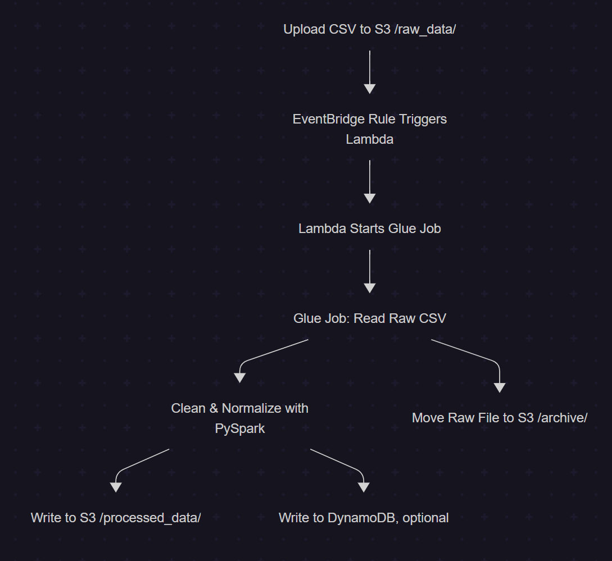

# 🚀 Serverless ETL Pipeline with AWS Glue, PySpark & EventBridge

This project showcases a fully serverless ETL data pipeline that processes startup funding data using **PySpark**, **AWS Glue**, **Amazon S3**, **DynamoDB**, and **EventBridge**.

When a new CSV file is uploaded to the `raw_data/` folder in S3, the pipeline is automatically triggered using **EventBridge** and a **Lambda function**, which starts an AWS Glue job. The Glue job processes the raw data, cleans and normalizes it using PySpark, and writes the results to a processed location in S3 and optionally to DynamoDB.

---

## 🧩 Components

- **Amazon S3** — Stores raw, processed, and archived data.
- **AWS Glue** — Runs PySpark ETL jobs for data cleaning and transformation.
- **PySpark** — Cleans noisy text, normalizes startup names, parses investment amounts, and removes nulls.
- **DynamoDB** — Stores processed funding records (optional).
- **AWS Lambda** — Event-driven orchestration; triggers Glue job on new S3 uploads.
- **Amazon EventBridge** — Connects S3 PutObject events to Lambda.
- **CloudFormation** — Used to deploy infrastructure (S3 buckets, IAM roles, Athena, DynamoDB).

---

## 🔁 ETL Flow

1. 🚚 Upload raw CSV to `s3://<your-bucket>/raw_data/`
2. 🔔 EventBridge detects the file and triggers Lambda
3. ⚙️ Lambda starts the Glue job
4. 🧹 Glue job:
   - Reads and cleans raw data (removes nulls, formats amounts, lowers startup names)
   - Stores clean data in `processed_data/`
   - Archives original file to `archive/`
   - Optionally inserts records into DynamoDB
5. 🔎 Query results with Athena or DynamoDB

---

## 🧪 Sample Transformations

- Converts `"BYJU'S"` → `byju's`
- Handles invalid UTF-8 characters (e.g., `\\xe2\\x80\\x99`)
- Parses investment strings like `"5,00,00,000"` → `50000000`
- Drops fully null columns
- Publishes data quality metrics (using `EvaluateDataQuality` in Glue)

---

## 📁 Repository Structure



---

## ⚙️ Deployment Steps

1. Deploy the CloudFormation stack (S3, DynamoDB, IAM roles, etc.)
2. Upload a CSV to `s3://<your-bucket>/raw_data/`
3. Monitor Lambda logs for job trigger
4. Track Glue job in AWS Glue Console
5. View processed file in `s3://<your-bucket>/processed_data/`
6. (Optional) Query DynamoDB or Athena

---

## 🔧 Technologies

- 🐍 PySpark
- ☁️ AWS Glue (ETL & Data Quality)
- 💾 Amazon S3
- 🔁 AWS Lambda & EventBridge
- 🧾 Amazon DynamoDB
- 📈 Amazon Athena
- 🛠️ AWS CloudFormation (Infrastructure as Code)

---

## 📊 Sample Athena Query

```sql
SELECT startup_name, SUM(amt_in_usd) AS total_funding
FROM startup_funding_table
GROUP BY startup_name
ORDER BY total_funding DESC;


👨‍💻 Author
Shiva Dey
🧠 Backend Developer | Big Data & Cloud (AWS Glue, PySpark) | Python, Java | Full-Stack on the Rise ⚛️
🔗 [LinkedIn](https://www.linkedin.com/in/shiva-d-13495821a/)
📫 shivadey108@gmail.com

🏷️ Tags
#AWSGlue #PySpark #ServerlessETL #DataEngineering #EventBridge #DynamoDB #Lambda #S3 #CloudFormation

